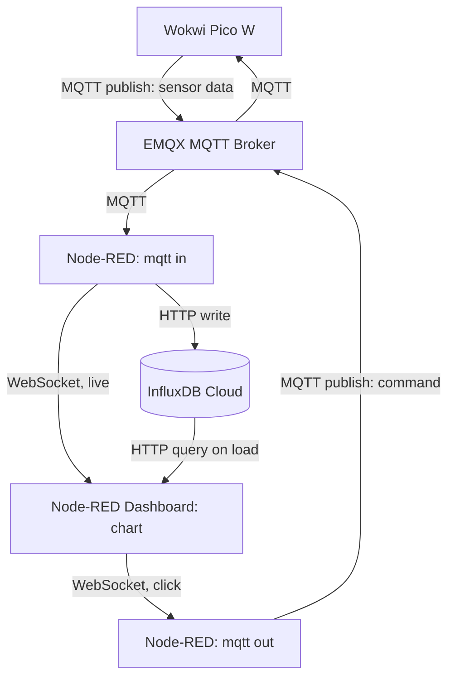

# IoT Assignment Report — Kevin (kl223py)

## 1) Project Links

- **Live Dashboard URL:** https://iot-dashboard-u1r9.onrender.com/dashboard/page1
- **Wokwi Simulation URL:** https://wokwi.com/projects/473231002212299777
- **Backend/Database URL:** https://eu-central-1-1.aws.cloud2.influxdata.com
- **Repository URL:** https://gitlab.lnu.se/1dv027/student/kl223py/assignment-iot

---

## 2) Project Overview

This project is a simulated IoT device built with a **Raspberry Pi Pico W** in Wokwi. It has an LED and a button. The device connects to WiFi and talks to an MQTT broker to send data and receive commands.

- **Hardware:** Raspberry Pi Pico W, one LED, one button and one resistor
- **Sensor data:** Every 2 seconds, the device sends a fake sensor value (a random number between 0–100) over MQTT. This stands in for a real sensor reading.
- **Control:** The dashboard can send a message back to the device to turn the LED on or off. This shows two-way communication.
- **Dashboard:** Built with Node-RED and the `@flowfuse/node-red-dashboard` package. It shows a chart of sensor values (loads old data on startup, then keeps updating live) and two buttons to turn the LED on or off.

---

## 3) Architecture and Data Flow

Data moves in two directions:

- **Device → Broker → Node-RED → InfluxDB → Dashboard** (sensor data)
- **Dashboard → Node-RED → Broker → Device** (LED command)



**Protocols used:**
- **MQTT** (port 1883) — used between the device, the broker, and Node-RED, for both sensor data and commands
- **HTTP/HTTPS** — used by Node-RED to write data into InfluxDB, to query historical data on dashboard load, and to load the Node-RED dashboard page itself in the browser (hosted on Render)
- **WebSocket** — used behind the scenes so the dashboard chart updates live and button clicks reach the server, without needing to refresh the page

---

## 4) Database Strategy

- **Database used:** InfluxDB Cloud (free plan) — a database made for storing data with timestamps, which fits sensor readings well
- **How the data is organized:**
  - **Bucket:** `iot_data`
  - **Measurement:** `sensor_data`
  - **Field:** `value` (the number sent by the sensor)
  - **Timestamp:** the time each reading was received, plus a `serverTimestamp` field added by Node-RED at ingestion time
- **Other notes:**
  - Data storage length (retention) was left at the default, since this project only runs for a short time and doesn't produce much data
  - No extra processing (like averaging or downsampling) was needed — the dashboard just asks for the last ~30 minutes of data when the page loads
  - InfluxDB handles indexing automatically since it's built for time-based data

**Historical data access path chosen: Path C (Node-RED).**
An `inject` node fires once when the flow deploys/starts, triggering an `influxdb in` node that runs a Flux query against the `iot_data` bucket for the last 30 minutes of `sensor_data`. A function node reshapes the result into `{x, y}` points, which are sent into the same dashboard chart node used for live updates. Example query:

```flux
from(bucket: "iot_data")
  |> range(start: -30m)
  |> filter(fn: (r) => r._measurement == "sensor_data")
  |> filter(fn: (r) => r._field == "value")
```

If the query returns no data (e.g. right after a fresh deploy), the reshaping function falls back to an empty array instead of erroring, so the chart just renders empty rather than crashing the flow.

---

## 5) MQTT Topics and Payload Documentation

| Direction | Topic | Payload | What it does |
|---|---|---|---|
| Device → Dashboard | `lnu/iot/kl223py/sensor` | `{"value": 47, "timestamp": 1735000000}` | Sends a fake sensor reading every 2 seconds |
| Dashboard → Device | `lnu/iot/kl223py/command/led` | `{"state": true}` | Turns the LED on (`true`) or off (`false`) |

**Broker used:** `broker.emqx.io` (a free public broker), port `1883`.

**Note on ingestion:** Node-RED wraps the JSON parsing step in a try/catch, so a malformed payload is logged as a warning and dropped rather than crashing the flow. A server-side `serverTimestamp` field is also added to every valid message at the point it's received by Node-RED.

---

## 6) Reflection

**Which frontend technologies did you choose, and why?**

I used Node-RED with the `@flowfuse/node-red-dashboard` package instead of building my own website from scratch. I already had some experience with MQTT and Node-RED from earlier in the course, so this let me spend my time getting everything working correctly instead of writing a lot of frontend code (charts, WebSocket connections, API routes) by hand. Node-RED's drag-and-drop editor also made it easier to see and explain how the data moves through the system.

**How does handling real-time MQTT data over WebSockets differ from a standard REST API workflow?**

With a normal REST API, the browser has to keep asking the server "is there anything new?" over and over (this is called polling). That means it either checks too often (wasting requests) or not often enough (data feels delayed). MQTT over WebSockets works differently — the connection stays open, and the server pushes new data to the browser the instant it arrives. This makes it much faster and more efficient for something like sensor data that updates every few seconds. The downside is that it's a bit more work to manage, since the connection needs to stay alive and reconnect if it drops, while REST requests are simpler one-off calls that are easy to retry.

**What was the most challenging integration step, and how did you solve it?**

The hardest part was getting live data to actually show up on the dashboard chart, even though the rest of the pipeline (MQTT, Node-RED, InfluxDB) was already working. Two problems were stacking on top of each other:

1. The live data path in Node-RED wasn't actually connected to the chart node — only the "load old data on startup" path was. So the chart only ever showed one snapshot from when I deployed, and never updated after that.
2. Once I connected it, the chart still didn't update, because the live message and the historical message weren't shaped the same way. The historical data was formatted specially for the chart, but the live data was just a plain object with a value inside it.

I found this by adding a debug node to check exactly what was arriving at each step, and then fixed it by adding a small function node to pull out just the number before sending it to the chart, and by properly wiring the live MQTT path directly to the chart node.

Deploying to Render also caused a smaller issue: my flow file wasn't loading at first because Node-RED was creating a new empty file instead of using mine. I fixed this by adding a `settings.js` file that tells Node-RED exactly which file to use. I also had to manually re-enter my InfluxDB API key after moving to Render, since keys aren't included when you export/import a flow (for security reasons).

---

## Demo

Short recording showing Wokwi running, the dashboard updating live, and the LED responding to the dashboard button:


---